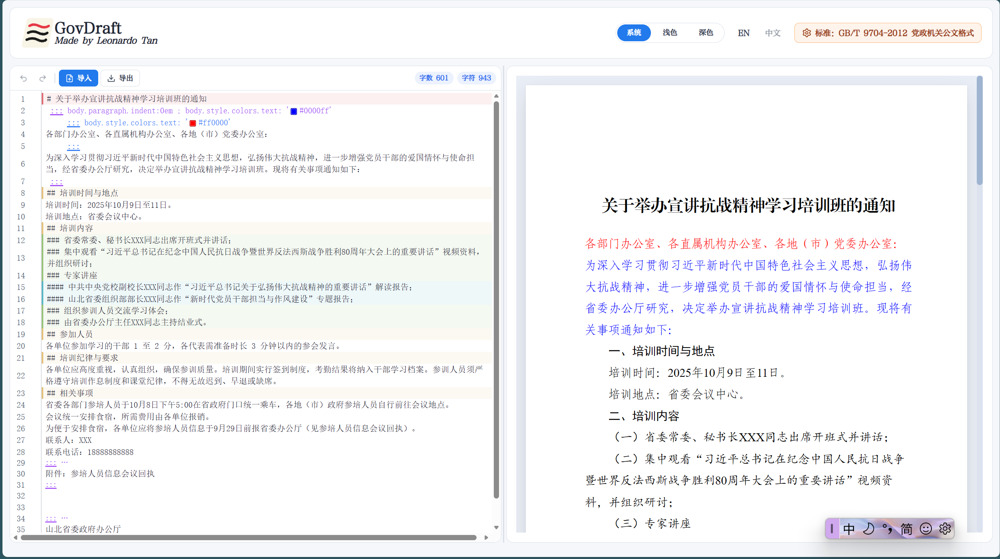
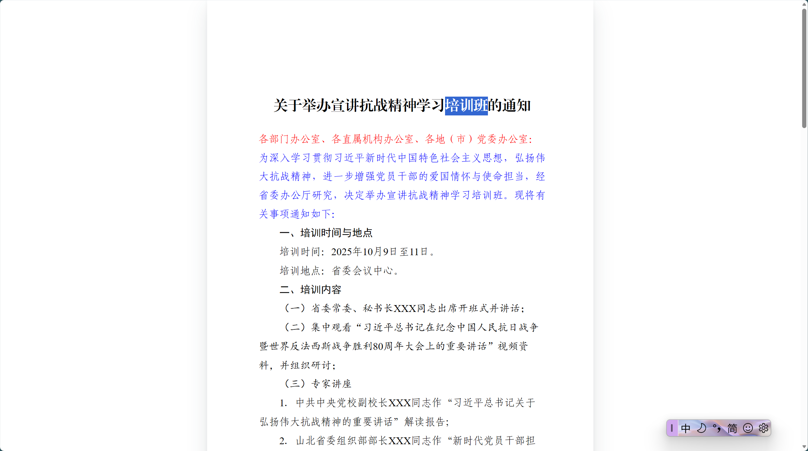

# gov-draft

公文排版系统（Vue 3 + TypeScript + Vite），支持基于规则的样式编译、预览与导出。

## 环境要求

## 功能

- Markdown 编辑与实时预览
- 基于 YAML 规则的样式编译
- 分页、页边距和页码配置
- Markdown 导入，HTML/PDF 导出
- 内置规则设置与中英文界面切换
主页图：

导出效果图：

## 快速开始

```bash
pnpm install
pnpm dev
```

默认开发地址：`http://localhost:5173`

## 常用命令

```bash
pnpm dev          # 启动开发服务器
pnpm build        # 类型检查并构建
pnpm preview      # 预览构建产物
pnpm lint         # 代码与样式检查
pnpm lint:fix     # 自动修复可修复问题
pnpm test         # 运行测试
```

## 核心目录

- `src/core/rule-engine/`：规则引擎（编译、作用域、变量、校验）
- `src/core/parser/`：Markdown 解析
- `src/composables/`：组合式逻辑
- `src/stores/`：Pinia 状态管理
- `src/types/`：类型定义
- `docs/`：规则与样式架构文档
